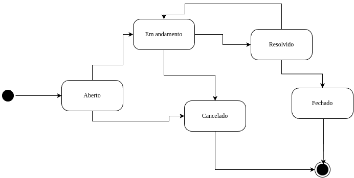
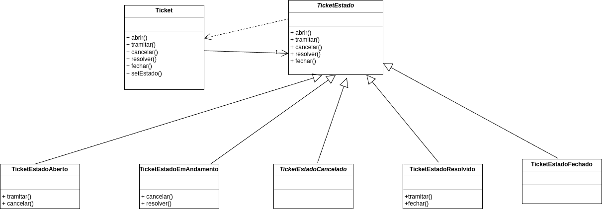

# Ticket - Padrão de Projeto State

Este é projeto que implementa o padrão de projeto **State**. Sua principal funcionalidade agora é gerenciar o estado dos tickets de forma dinâmica. O padrão permite que o comportamento do ticket varie conforme seu estado atual, facilitando a manutenção e a expansão dos fluxos.

---

## Diagrama de Estados

---

## Diagrama de Classes

---
